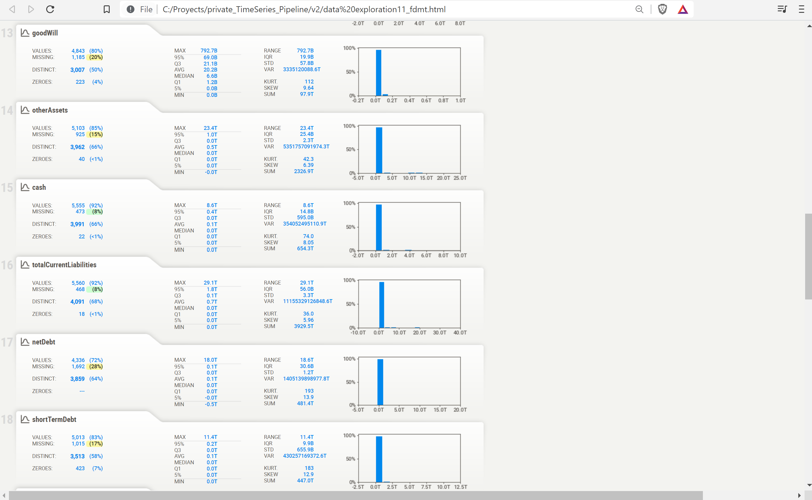
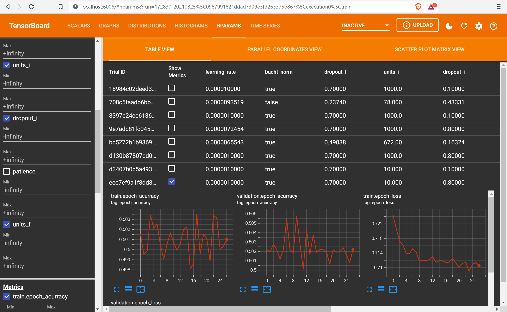
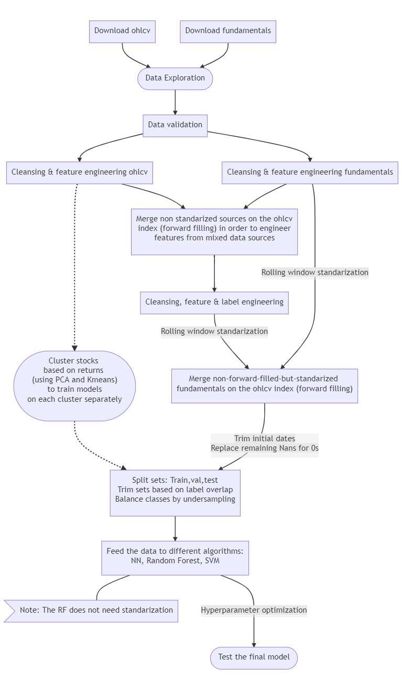

# Description
This project consists of a pipeline where:
1. Financial data of the market and fundamental kind is downloaded from [eodhistoricaldata.com](https://eodhistoricaldata.com).
2. Preprocessing is done on the data
3. The data is fed to ML algorithms to create time series forecasting classification models that attemp to predict the direction of stock prices. 

# Usage

### Setup
- Clone the repository
- (Create a virtual env) 
- Install the dependencies running `pip install -r -requirements.txt` in your terminal

### Run
- Inside the `download.py` file, substitute the TOKEN variable for your api key from [eodhistoricaldata.com](https://eodhistoricaldata.com)
- Run the `run_pipeline.py` file

### Visualizations

 
 Show 

  
- Sweetviz : After downloading data by running `0_download.py`, run the `1_data_exploration.py` file to see raw data statistics in your browser using sweetviz library:
 

 
- Tensorboard : At the end, during/after the neural net training, run: `tensorboard --logdir TensorBoard_logs/data` in your terminal. A link to a localhost port will be shown.
If you click on it it will open a Tensorboard dashboard with info from the hyperparameter tuning process in your browser:

 
 

# Pipeline flowchart

### Notes on label engineering

- The time horizon of the labels is based on the current volatility of the prices. They are generated using a method taken from Marcos´s Lopez de Prado book "Advances in Financial      Machine Learning" (specifically from Chapter 3) which he coins the "triple barrier method"; it attemps to simulate real stop-losses and profit-taking.

- The technique to remove label overlap is also from "Advances in financial Machine Learning" (Chapter 7).

### Notes on standarization and forward filling

- The standarization of fundamental features is done before the final merging of data sources because of these considerations: 
      The market and fundamental datasets have different index values (dates), and so they are merged on the market dates 
      using pandas´ 'merge_asof' method because the fundamental data is sparse compared to the market data. 'merge_asof' by default
      forward fills fundamental data on the market dates index. Forward filling is used with time series data to avoid data leakeage.
      A rolling window standarization is also often used when working with time series data instead of standarizing across all values to avoid data leakage.
      In this case, if a rolling window standarization of the fundamental features were to be done after and not before forward filling them
      on the market dates index by using of 'merge_asof', then the rolling window standarization would be biased by the forward filling

- Most of the features to be engineered, which are taken from fundamental or technical analysis literature, are to be engineered before 
  standarizing the features they are engineered/extracted from

- The reason the 2 data sources are merged and then feature engineering is done, and then datasets are merged again, is because:    
      Some features are created/engineered using various features from both market and fundamental data. 
      Both sources have to be merged in order to engineer said features.
      However, as mentioned in the previous point, these features are to be engineered before standarizing the features that they come from,
      and at the same time, as mentioned in the first point, the standarization of fundamental data is done before the final merging
      (because a rolling window standarization is used and at the same time when merging the fundamental data is forward filled on the market data index)

- Most technical indicators are already normalized in some way by design

- The random forest does not need standarized data
 
